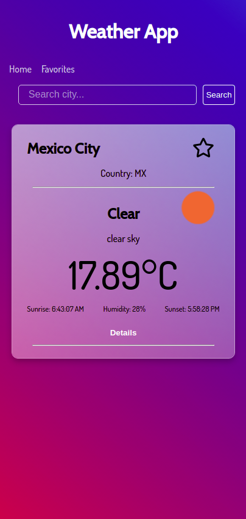

# Weather App

This app let you search cities to see their details like temperature, wind, humidity, and more. Also let you save your favorite cities to access their quickly.

## Preview

Here you can see a preview of the mobile design.

If you want to give it a try to the app, you can visit it here [Weather app](https://angelpineda-dev.github.io/aj_weather-app/)

## Technologies

The next is the technologies that were use to build this app.

- React js
- React router
- Redux
- Sass
- Sweet alert
- Gsap

By the way, this app was build with __node v16.13.0__ and __npm 8.1.0__. If you want to run this on your on computer, you have to execute the comand __npm install__, this will create the folder __node_modules__ then you can run the comand __npm start__

## Contact

We all keep learning new things day by day. If you have questions o some comment that would help me, plese let me know.

- [Web site](https://angelpineda-dev.github.io/Home/)
- [Github](https://github.com/angelpineda-dev)
- [Twitter](https://twitter.com/angelpineda_dev)
- [LinkedIn](https://www.linkedin.com/in/angelpineda-dev/)
